# Документация проекта

## Предисловие
Привет. Перед тем как ты погрузишься в прочтение данного документа, хочу прояснить сразу некоторые моменты, и ответить на вопросы которые, как мне кажется могут возникнуть почти сразу. 
Первое что хотелось бы сказать, данный документ - это наброски мечтателя, человека, который уже на протяжении долгого времени хотел бы реализовать то что написано тут. Это начальный дизайн документ проекта, не конечная версия и он постоянно будет дописываться и переписываться. Тут я описываю все идеи которые появляются. Многие из которых в последствии могут быть отброшены, упрощены и т.д. Ведь это только все на бумаге и не понятно как будет смотреться в самой игре вместе с остальным контентом.
Второе, вы наверное скажете, что для первого проекта, отсутствия полноценного опыта в данной сфере и т.д. реализовать данный проект не реально. И тут вы скорее всего правы, что для такого проекта необходимо куча рабочей силы (людей), бессонных ночей и в последствии это может привести к мертвому незаконченному проекту.
Вот моя мысль на этот счет: Ну а кто говорит, что нужно бросаться и делать все что тут описано сразу? Можно выбрать какой-то определенный минимальный контент который постепенно можно будет развивать. Т.е. определить базу (основные аспекты игры, которые позволят играть хоть во что-то), с чем в последствии можно будет работать и наращивать.
Далее я не буду использовать фразы по типу: "дада я знаю, что хотелка у меня большая, но а почему бы и нет", просто хочу чтобы вы помнили мысль которую я озвучил выше.

## Development stack (стек разработки):
```
Engine: Unreal Engine 5
Database: Postgresql
CI/CD: Gitlab or Github + Jenkins
Other: Servers in k8s
```

## Platform (платформа):
Платформа(ы) на которых планируется релиз. А именно на PC, если игра получит положительный отклик, можно будет рассмотреть вариант порта на мобильную аудиторию.

## Games concepts (игры концепты):

Игры на которые стоит обратить внимание при разработке данного проекта, а так же для большего понимания того, что я пытаюсь тут вам донести. Они имеют примерный стиль или концепт.

### The Last Stand: Aftermath

На что стоит обратить внимание:

* Дизайн / стиль локаций
* Управление (поведение персонажа, стрельба)
* Расположение камеры?

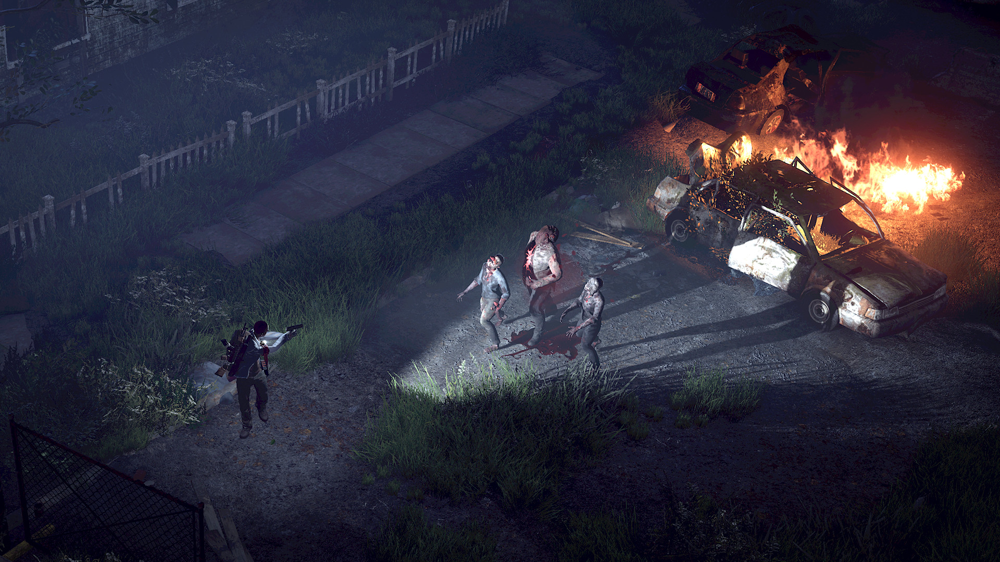

### Thunder Tier One

На что стоит обратить внимание:

* Дизайн / стиль локаций
* Управление (поведение персонажа, стрельба)
* Возможности камеры (повороты, вид сверху в помещениях)

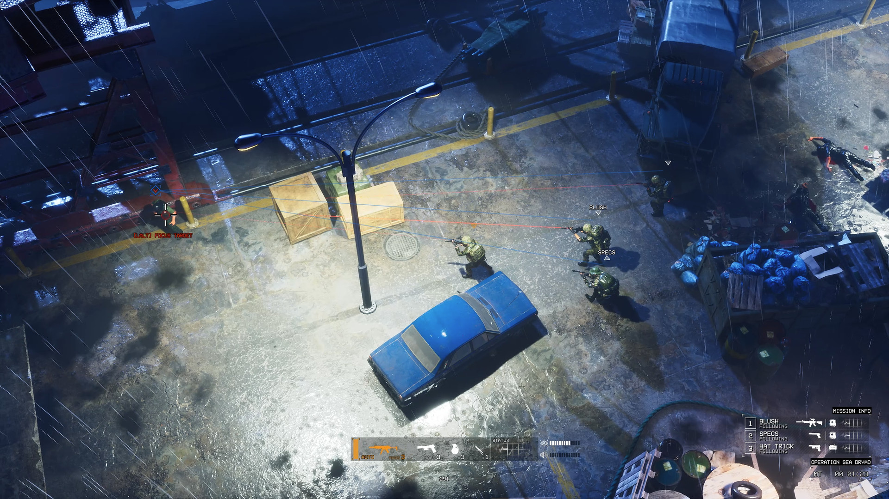
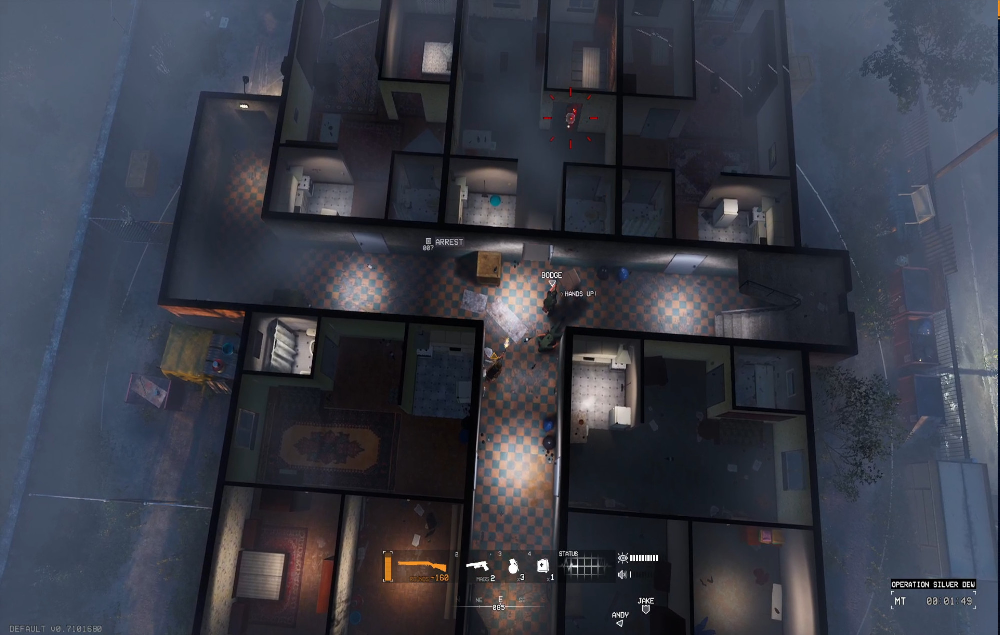

### Tunguska: The Visitation

На что стоит обратить внимание:

* Атмосфера (сталкер)
* Управление
* Стрельба?

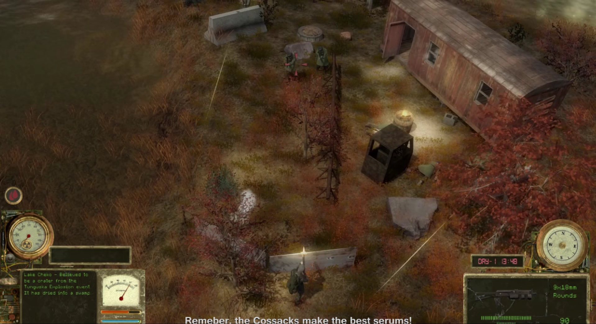
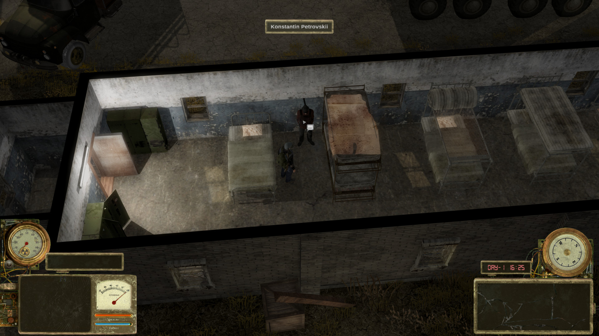

### Last Day on Earth: Survival

На что стоит обратить внимание:

* Дизайн
* Управление

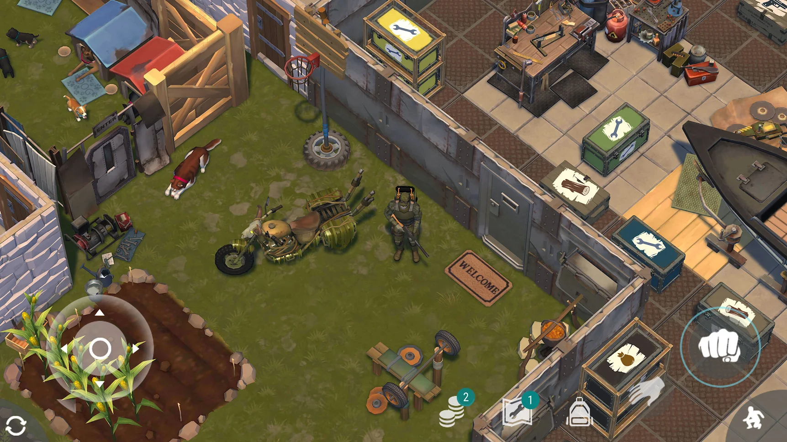
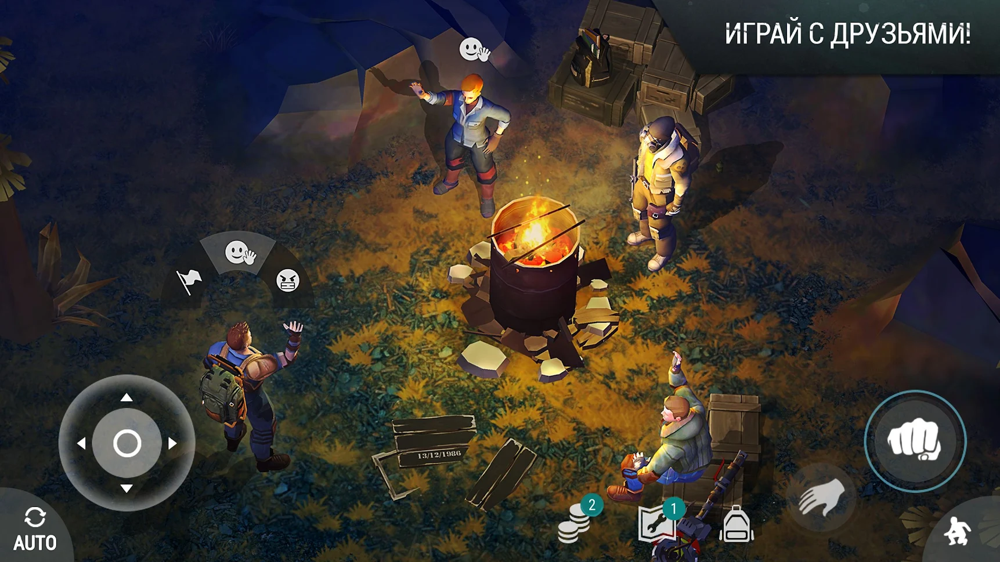

## Foreword 2 (предисловие 2):
Итак, теперь когда вы ознакомились с проектами, которые можно взять за основу, я постараюсь подробно описать, то что хочу получить на выходе. Если рассмотреть данные проекты, то мы можем заметить, то что их объединяет в большинстве случаев: вид сверху / изометрия / 2.5D, названий у этого куча, но да, я хочу чтобы управление было в таком стиле. Итак, поехали по порядку.

## Style (стилистика):
Склоняюсь больше всего в какой-то степени к реализму, с разбросом в 50-100 лет вперед. Это игра не про магию и каких либо феечек. Я хочу видеть реальную жизнь после какой-то катастрофы, зомби апокалипсиса, вторжения инопланетян (что вполне реально и интересно). Например действия игры сначала развернутся в каком-то поселении или части карты, где даже игроки не смогут использовать или найти огнестрельное оружие, будут бегать как попуасы (как в игре Voodoo от indiegala) с камнями, палками и луками в лучшем случае. Ну а почему и нет? Далее по мере прохождения, игра будет открывать игрокам более развитые поселения (города, территории или части карты). По итогу конечно же мы можем прийти до стадии с плазмоганами и т.д. но очень бы хотелось не выходить за рамки представления нашей реальности. Вот взять Cyberpunk 2077 в принципе +- можно пока остановиться на такой планке с имплантами (это все можно сувать например как одежду) и т.д.
Ну конечно же можно и впилить какие-нибудь редкие шмотки с магическими свойствами от предков или же из будущего, но не так чтобы их было очень много.
По мере прохождения игры изменяется дизайн локаций, внешний вид персонажа (костюмы и оружие), возможно даже внешность?
Сам мир постапокалипсиса будет выделяться разрушенными городами и заброшенными бункерами

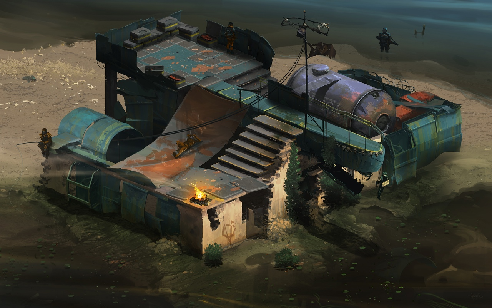
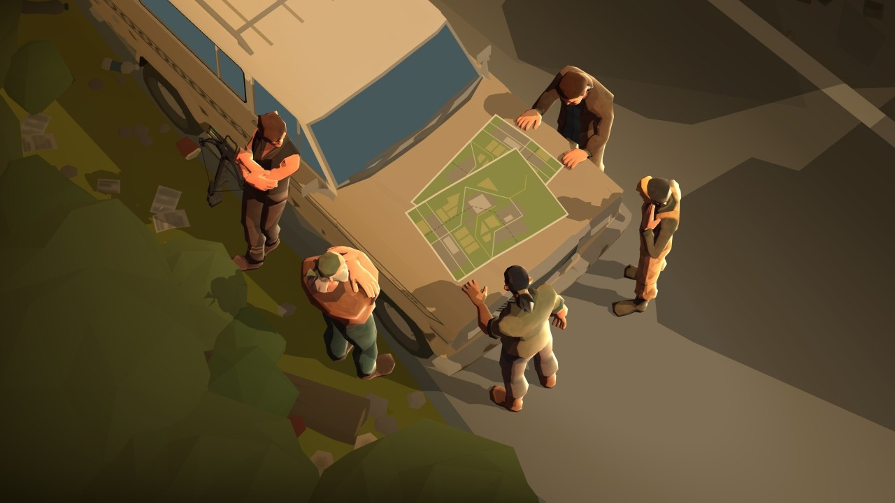

## NPC Style (стилистика npc, мобов):
Стилистика мобов, нпс и монстриков - в основном это человеко подобные существа. Возможно с какими-то отклонениями, дефектами или иными изменениями. С оружием ближнего, дальнего боя. Мутации aka сталкер?

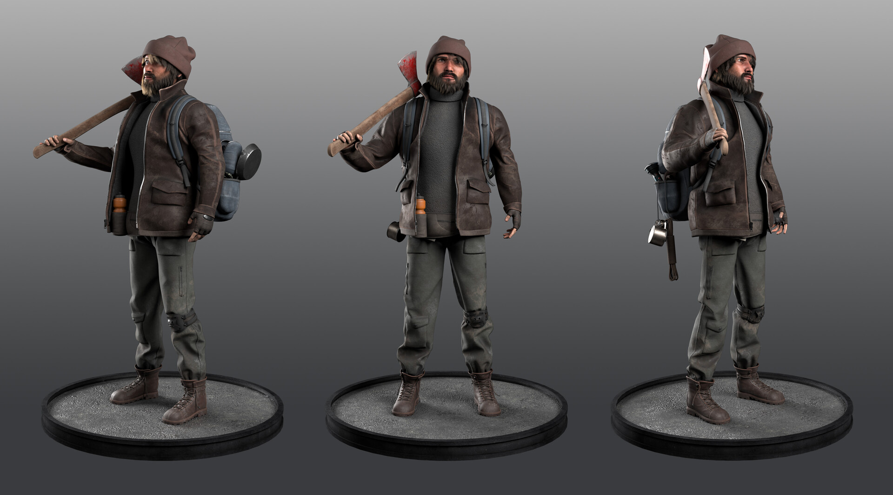
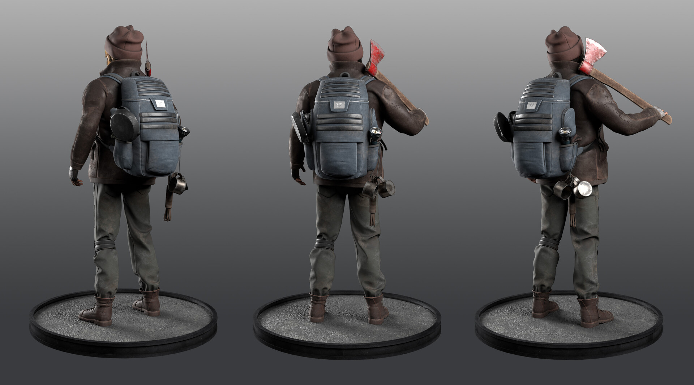
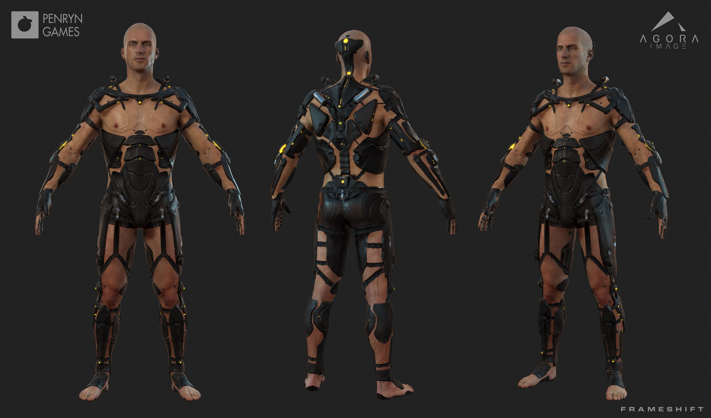
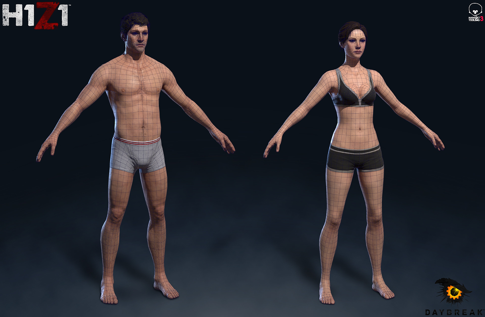
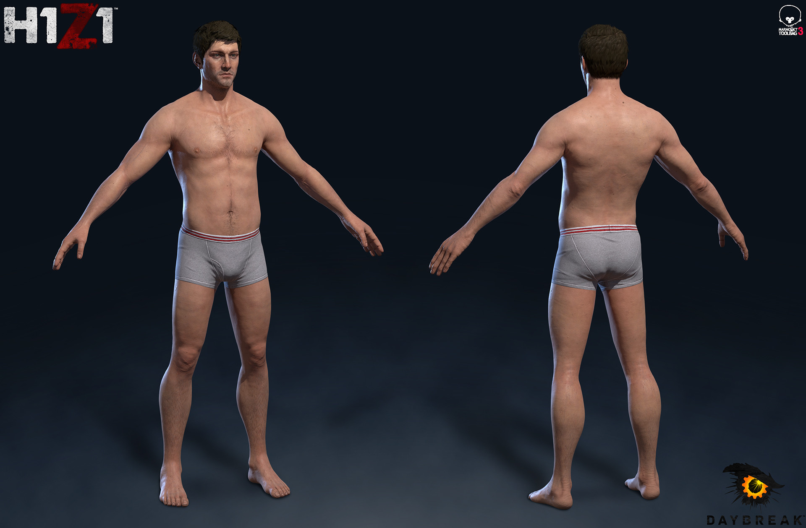
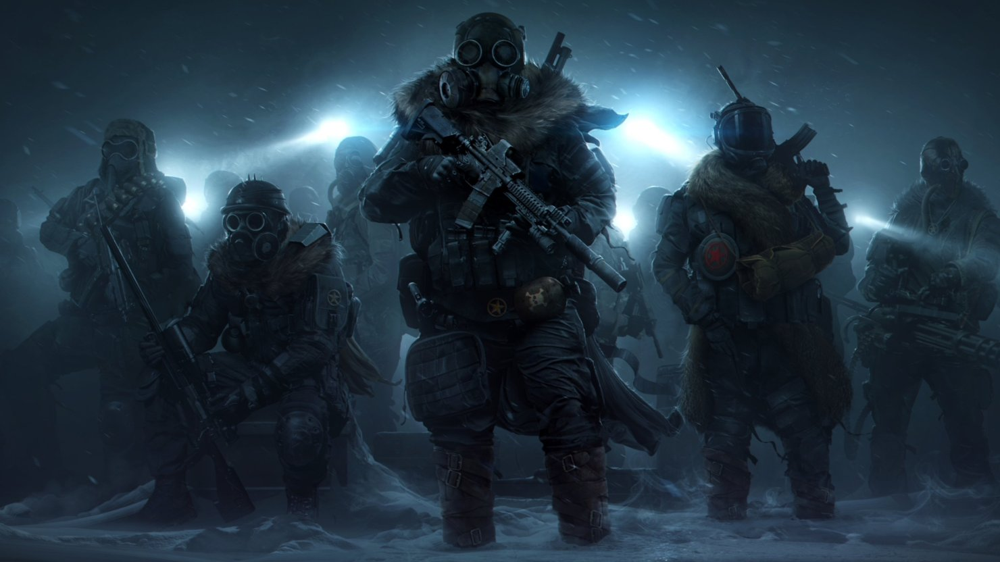

## NPC (не игровые персонажи):
- Странствующие торговцы, которые по времени в разных местах локации спавнятся на минут 20-30

## Functionality of settlements (функционал поселений):
- Почтовые ящики в городах (поселениях), можно отправить текстовое сообщение и вложить туда предмет (не персональный). Получение и отправка только у них. Возможно какое-то уведомление о получении нового письма.

## History (история):
ИСТОРИЯ - вот один из главных моих минусов. Историю, сюжета и сценария пока нет. Как и адекватных идей на данный момент. Пока пропустим.

## Character customization (кастомизация персонажа):
М/Ж варианты. Чем сложнее, чем больше всяких мелких деталей, тем лучше.

## Region clusters (региональные кластера):
Чтобы в дальнейшем можно было устраивать битвы кластеров? Кластер - отдельный сервер, но между ними можно было бы перемещаться. Экономики и все остальное разное. Перемещение где-то на краях карты, спрятанные телепорты. Так чтобы переместиться было очень сложно.

## Maps (карта):
Огромный открытый бесшовный мир (возможно сделать так чтобы бежать от одного края до другого заняло несколько дней? ну и соответственно без прокачки игрока будут сразу убивать без возможности пройти всю карту за день), без всяких загрузок между локациями и т.д. Возможно какие-то отдельные локации и будут, но по минимуму. Загрузка определенного контента вокруг персонажа на определенном радиусе, а не всей карты давно уже не новость и вполне реализуемо.
По большей части сухопутный контент, в дальнейшем возможно стоит рассмотреть и водный.
Скрытые двери в комнаты, тайники, проходы, щели в горах, загадки и тд. Хотелось бы добавить такие штуки в которых или за которые можно будет получить определенные плюшки, ачивки или тому подобное. Например первому кто найдет выдать ачивку, повышенный опыт к какому-нибудь навыку (подумаем дальше) и какой-нибудь редкий предмет. Ачивки в стиле "Первый кто нашел тайную комнату" и "Зоркий глаз в доме на горе", нашел тайный подвал в доме.
Разные климатические зоны! Степь, снега, пустыня и т.д. Возможно будет влиять на одежду которую носит игрок.

## Global map (глобальная карта):
Интересный момент. Если учитывать огромную карту, можно ли сделать так чтобы карта открывалась квадратами или гексами, как туман войны? Зачем? А что если сделать возможность продавать части карты, или координаты определенных мобов, боссов или шпионскую информацию о скоплениях, группах кланов и тд? Прикольно же да?

## Fraction (фракции):
Так называемые кланы не игровых персонажей, NPC и мобов. Могут иметь разные отношения между собой, враждебные, мирные или нейтральные. В последствии игроку придется присоединиться к одной из фракции (возможно). А может быть лучше не давать конкретного выбора, а просто сказать, вот ты делаешь квесты от одной фракции то репутация у этой фракции растет, а у других фракций будет репутация ухудшаться. Вплоть до запрета посещения определенных поселений подконтрольных этой фракции.
По началу игрок принадлежит какой-нибудь фракции Нищие (бедные или какое-то такое название) или может быть вообще без фракции.

Что-то еще:
- Придумать мотивацию игры за определенную фракцию, если у той мало или нет захваченных территорий игроками и стоит просто город или поселение. Быстрее прокачка, или наоборот медленней но при этом он сильнее?
- Захват, постройка, восстановление или же уничтожение объектов фракций.
- Захват территорий.

## Fraction reputation (репутация фракций):

## Fraction territory war (война за территории фракций):
Война за территории между фракциями. Тут и так из названия все понятно. При захвате территории одной фракцией у другой портится отношения между фракциями и имеют свои последствия.

## Events (ивенты):
Ивенты, или действия которые влияют на мир или будущее мира. Например, будет квест, у которого будет 2 варианта ответа, возьмем банальщину: убить или оставить в живых какого-то НПС с именем Рэнди, собираем статистику и при следующем обновлении учитываем выбор игроков. Этот Рэнди принадлежит какой-то фракции, и если игроки решат его все таки оставить, то можно будет устроить скидки в магазине этой фракции на определенный срок в благодарность.
Так же любые другие действия, захват какого-то здания, базы и т.д. 
Например: Включен коэффициент опыта 1. Происходит какое-то действие, в чате видим уведомление, что Коэффициент увеличен до 2 на 5ч из-за какого-то действия.

## Vehicles (Транспортные средства):
Животные: Лошади, ослы, верблюды и т.д.
Механические: машины развалюхи, мопеды, мотоциклы и т.д. 

Трудно получить (собрать / скрафтить), нужен очень прокаченный навык.
Дорогое топливо, для транспортных средств одно - которое более распространено. Для техники которую можно использовать - другое, без захваченных месторождений не получить. Управление роботами (aka Аватар)?

## Camera (камера):
Камера расположена чуть под углом и смотрит на персонажа в центре экрана. Камера привязана к персонажу, "улететь посмотреть и посмотреть, что там дальше за карта" не получится. Однако обзор можно будет увеличить или сместить при разных ситуациях (например при использовании какого-то умения или оружии (например, винтовок).

## Combat system (система боя):
like a The Division?

## Character progress (прокачка):
Одно из самых сложных механик.
Уровень персонажа.
Опыт к уровню можно получить за любое действие сделанное в игре.

Навыки владением оружием:
	- Огнестрельное оружие (обычная классификация, возможно стоит что-то поменять):
		- Пистолеты
		- Винтовки
		- Автоматы
		- и тд
	- Оружие ближнего боя (обычная классификация, возможно стоит что-то поменять):
		- Колющее
		- Дробящее
		- и тд
Навыки, второстеперенные какие-то хуйни которые можно прокачивать, пока думаю...

## Equipment (снаряжение):
Комплекты снаряжения, которые дают дополнительные бонусы за счет количества одетых одинаковых частей сета. 2 из 5, 3 из 5, 4 из 5 и т.д.

## Achievements (система достижений):
- Поймать все виды животных

## Система разделения карты на PVE / PVE и мирные территории.
Имеем несколько типов состояний территорий:
- Мирные - Территории в которых запрещен урон по игрокам и NPC
- PVP - Территории в которых разрешен урон по игрокам
- PVE - Территории в которых разрешен урон только по NPC

## Clans (кланы):
- Возможность захватить территории для постройки базы
- База предоставляет большие возможности в плане стройки и т.д. добавляет бонусы

## Inventory (инвентарь):
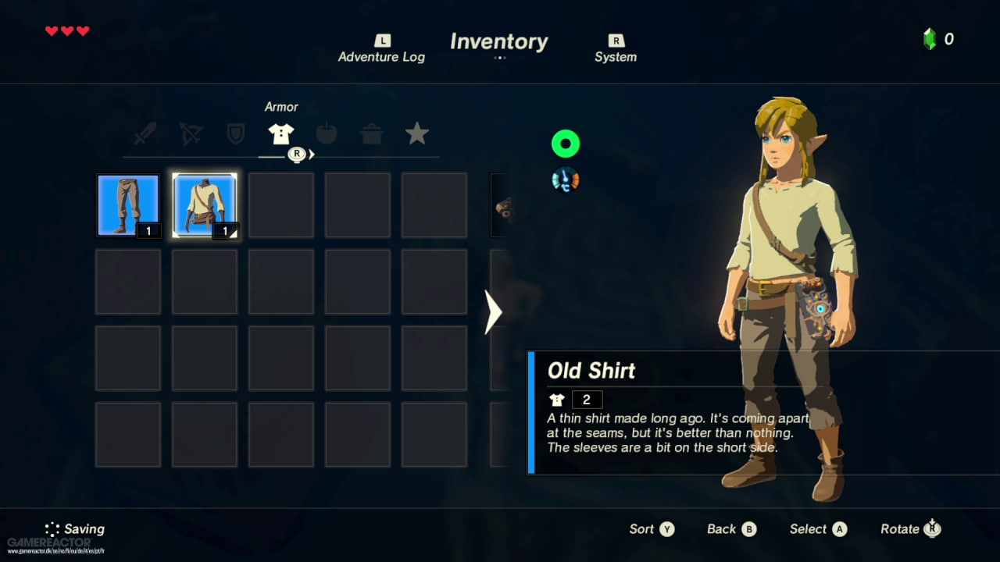
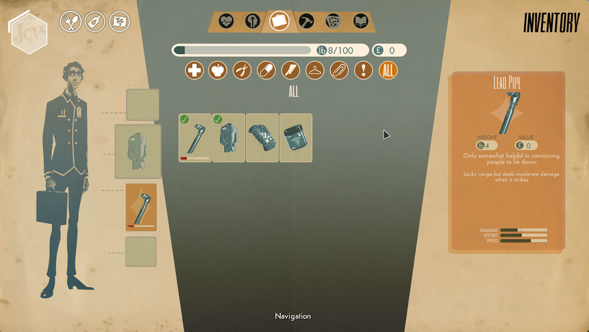
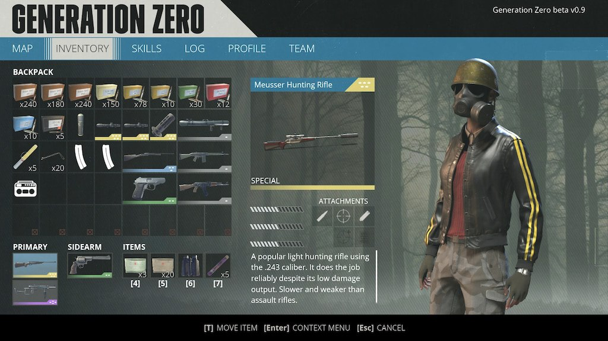
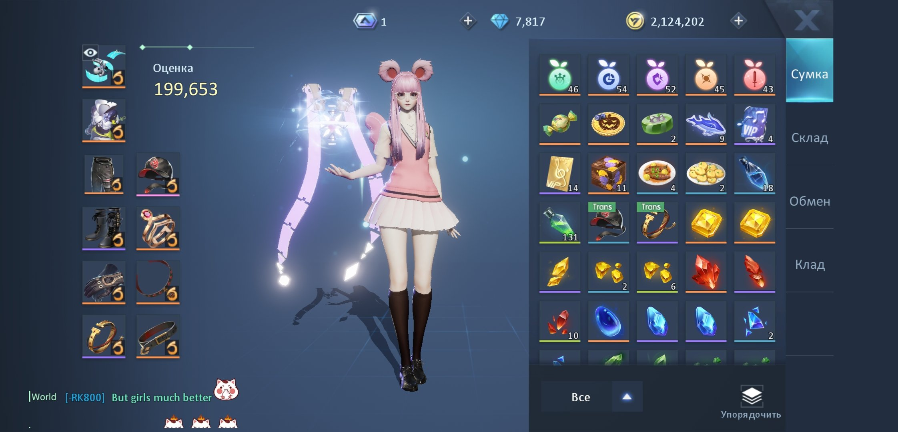
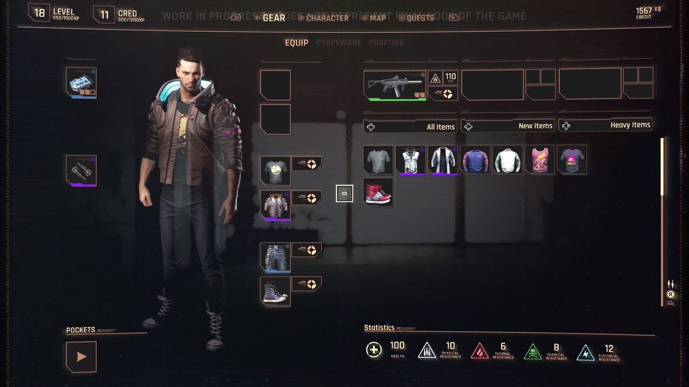
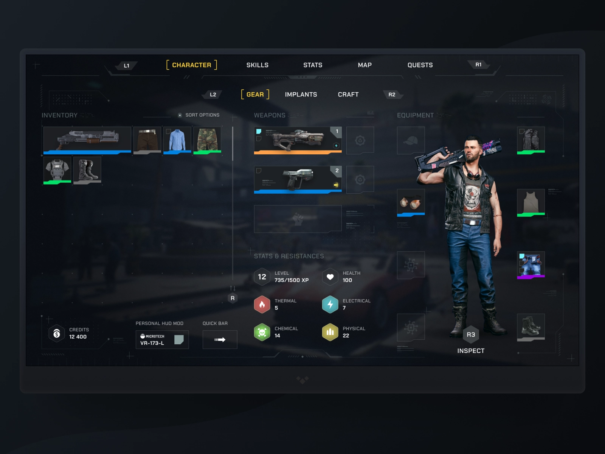
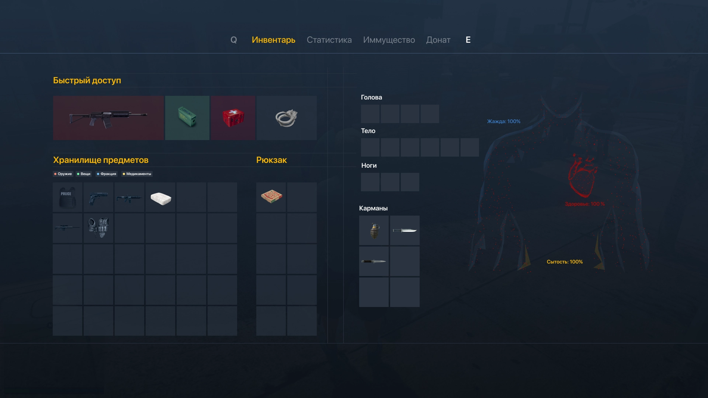
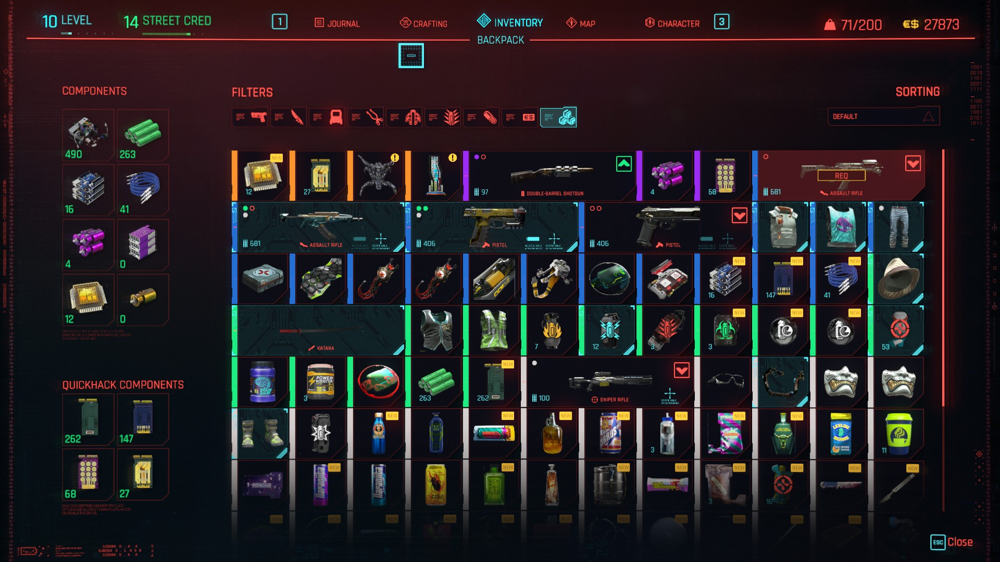
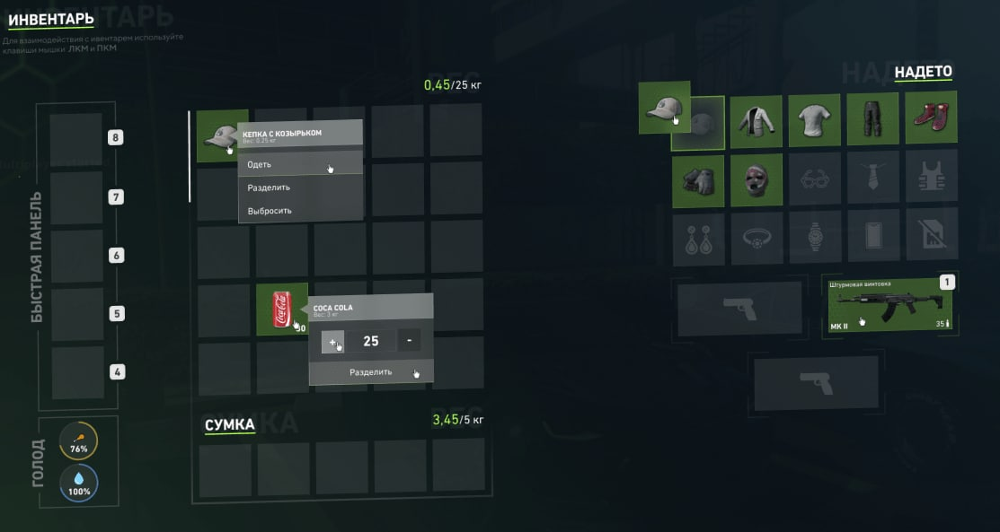
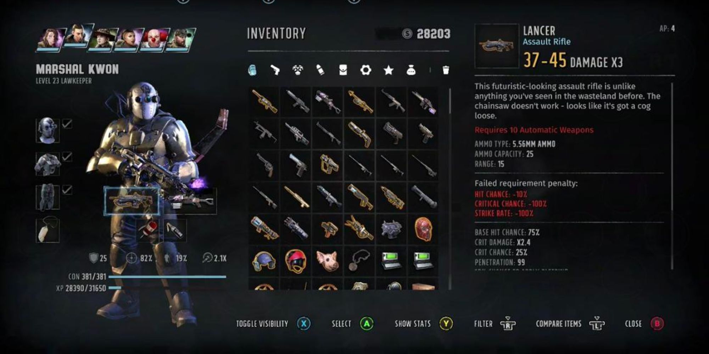

## Ideas (идеи):
Идеи которые пока не продуманы и записаны в краткой форме, но возможно в дальнейшем им может место быть:

- Постройка мини фортов (баз, аванпостов) для атаки. Для хранения снаряжения для битвы и тд. Можно сломать, чтобы предотвратить нападение.
- Система следов игроков. Игроки с прокачанным специальным навыком смогут отслеживать следы других игроков.
- Система получения дополнительных бафов, за счет сбора каких либо предметов или убийства мобов определенного кол-ва.
	- LostArk карты
	- BDM книги исследования
- Энергетическое поле которое работает только на определенную группу игроков? Или же если это база которая покрыта полем, оно не работает только на игроков клана который удерживает эту базу. И т.д.
- Симуляция каких-то действий
- Запрещен какой-то вид оружия на определенных территориях. Огнестрельное например.
- Специальный чип в шмотке, через который можно отправлять сообщения только для тех у кого он есть

## Demo (демка):
Как я вижу демку:
- Какая-то локация, или N локаций.
	- Первая локация - мирная, что-то по типу мини поселения
	- Вторая с ботами, где мы можем просто пострелять мобов, возможно что-то из них будет выпадать, рандомно или задано (на время теста)
	- Третья локация - ПВП, где игроки могут постреляться друг с другом
- Вернее это не локации, а все одна карта, только нужно каким-то образом разделить их
- В мирных локациях стрелять запрещено вообще
- В PVE локации урон другим игрокам не наносится
- В PVP - урон по игрокам и NPC

## TO DO:
- Переписать общее описание. Сделать его более предметнее. Нет понятия какой именно должен быть вид.
- Прикрепить видео примеры.
- Описать варианты стрельбы с мобильных устройств

## Extra examples
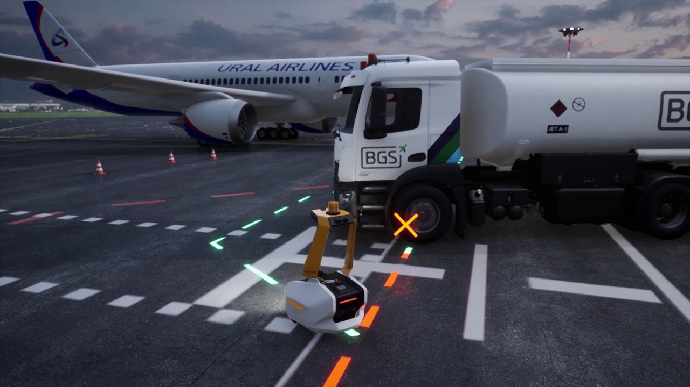